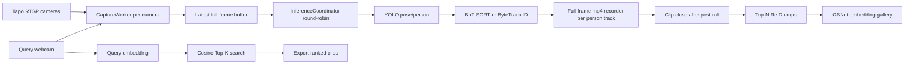

# Runtime 구조와 녹화/ReID 타이밍

## 전체 구조

## mp4 생성 타이밍

- YOLO+tracker가 새 사람 `track_id`를 만들면 `PersonClipRecorder`가 열립니다.
- mp4는 사람이 들어간 crop 영상이 아니라 원본 full-frame 영상입니다.
- track이 보이는 동안 capture thread가 들어오는 프레임을 계속 mp4에 씁니다.
- track이 사라진 뒤에도 `--post-roll-seconds` 동안 더 씁니다.
- 기본값은 2초입니다.

## ReID crop/embedding 타이밍

- 사람이 보일 때마다 ReID용 crop 후보를 저장합니다.
- crop quality가 높은 후보 top-N만 메모리에 유지합니다.
- clip이 닫힐 때 top-N crop을 jpg로 저장합니다.
- top-N crop embedding을 평균 내서 gallery embedding으로 등록합니다.
- 기본값은 `--live-visual-top-n 3`입니다.

## 너무 짧은 clip 처리

- 기본 `--min-clip-seconds 1.5`보다 짧은 clip은 mp4 파일은 남기지만 ReID gallery에는 넣지 않습니다.
- 이는 tracker가 잠깐 튄 경우 Top-K 후보가 오염되는 것을 줄이기 위한 설정입니다.

## 2프레임당 1번 분석

- 기본 `--inference-interval 2`입니다.
- capture thread는 full-frame을 계속 받습니다.
- inference는 오래된 프레임을 쌓아두지 않고 최신 프레임만 분석합니다.
- 9대 카메라 운영에서는 이 구조가 RTSP 지연을 줄이는 데 중요합니다.

